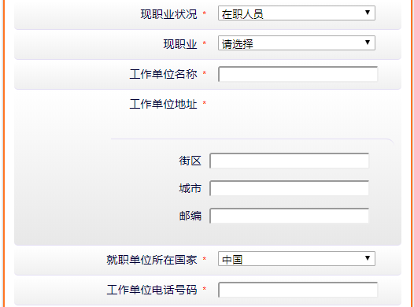
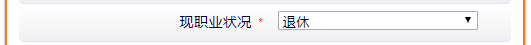
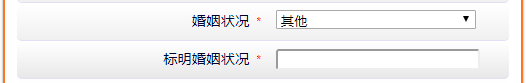
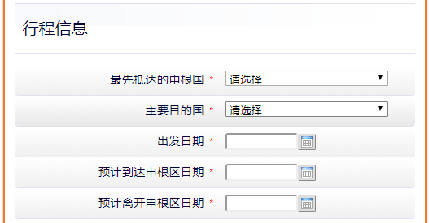

# 法国需要填写的信息

---

* [一 旅行目的\-个人信息](#%E4%B8%80-%E6%97%85%E8%A1%8C%E7%9B%AE%E7%9A%84-%E4%B8%AA%E4%BA%BA%E4%BF%A1%E6%81%AF)
  * [1\.固定](#1%E5%9B%BA%E5%AE%9A)
  * [2\.生日(监护人)](#2%E7%94%9F%E6%97%A5%E7%9B%91%E6%8A%A4%E4%BA%BA)
  * [3\.固定](#3%E5%9B%BA%E5%AE%9A)
  * [4\.护照种类:](#4%E6%8A%A4%E7%85%A7%E7%A7%8D%E7%B1%BB)
    * [因私护照](#%E5%9B%A0%E7%A7%81%E6%8A%A4%E7%85%A7)
    * [其它旅游证件](#%E5%85%B6%E5%AE%83%E6%97%85%E6%B8%B8%E8%AF%81%E4%BB%B6)
  * [5\.固定](#5%E5%9B%BA%E5%AE%9A)
  * [6\.现职业状况](#6%E7%8E%B0%E8%81%8C%E4%B8%9A%E7%8A%B6%E5%86%B5)
    * [在职人员](#%E5%9C%A8%E8%81%8C%E4%BA%BA%E5%91%98)
    * [企业法人](#%E4%BC%81%E4%B8%9A%E6%B3%95%E4%BA%BA)
    * [退休 / 无业](#%E9%80%80%E4%BC%91--%E6%97%A0%E4%B8%9A)
    * [学生](#%E5%AD%A6%E7%94%9F)
    * [其他](#%E5%85%B6%E4%BB%96)
  * [7\.是否居住在现国籍以外的国家](#7%E6%98%AF%E5%90%A6%E5%B1%85%E4%BD%8F%E5%9C%A8%E7%8E%B0%E5%9B%BD%E7%B1%8D%E4%BB%A5%E5%A4%96%E7%9A%84%E5%9B%BD%E5%AE%B6)
  * [8\.婚姻状况](#8%E5%A9%9A%E5%A7%BB%E7%8A%B6%E5%86%B5)
    * [已婚 / 未婚 / 分居 / 离异 / 丧偶](#%E5%B7%B2%E5%A9%9A--%E6%9C%AA%E5%A9%9A--%E5%88%86%E5%B1%85--%E7%A6%BB%E5%BC%82--%E4%B8%A7%E5%81%B6)
    * [其他](#%E5%85%B6%E4%BB%96-1)
  * [9\.固定](#9%E5%9B%BA%E5%AE%9A)
* [二 行程信息](#%E4%BA%8C-%E8%A1%8C%E7%A8%8B%E4%BF%A1%E6%81%AF)
  * [1\.固定\-目的国](#1%E5%9B%BA%E5%AE%9A-%E7%9B%AE%E7%9A%84%E5%9B%BD)
  * [2\.是否前往法属海外省\-海外领地](#2%E6%98%AF%E5%90%A6%E5%89%8D%E5%BE%80%E6%B3%95%E5%B1%9E%E6%B5%B7%E5%A4%96%E7%9C%81-%E6%B5%B7%E5%A4%96%E9%A2%86%E5%9C%B0)
    * [海外领地](#%E6%B5%B7%E5%A4%96%E9%A2%86%E5%9C%B0)
    * [法属美洲海外省](#%E6%B3%95%E5%B1%9E%E7%BE%8E%E6%B4%B2%E6%B5%B7%E5%A4%96%E7%9C%81)
  * [3\.固定](#3%E5%9B%BA%E5%AE%9A-1)
  * [4\.是否由某机构接待？](#4%E6%98%AF%E5%90%A6%E7%94%B1%E6%9F%90%E6%9C%BA%E6%9E%84%E6%8E%A5%E5%BE%85)
  * [5\.固定](#5%E5%9B%BA%E5%AE%9A-1)
  * [6\.旅费及在国外停留期间的生活费承担方](#6%E6%97%85%E8%B4%B9%E5%8F%8A%E5%9C%A8%E5%9B%BD%E5%A4%96%E5%81%9C%E7%95%99%E6%9C%9F%E9%97%B4%E7%9A%84%E7%94%9F%E6%B4%BB%E8%B4%B9%E6%89%BF%E6%8B%85%E6%96%B9)
    * [由申请人支付 / 由邀请方支付](#%E7%94%B1%E7%94%B3%E8%AF%B7%E4%BA%BA%E6%94%AF%E4%BB%98--%E7%94%B1%E9%82%80%E8%AF%B7%E6%96%B9%E6%94%AF%E4%BB%98)
    * [由赞助方支付](#%E7%94%B1%E8%B5%9E%E5%8A%A9%E6%96%B9%E6%94%AF%E4%BB%98)
* [三 曾获申根签证纪录](#%E4%B8%89-%E6%9B%BE%E8%8E%B7%E7%94%B3%E6%A0%B9%E7%AD%BE%E8%AF%81%E7%BA%AA%E5%BD%95)
  * [过去3年内是否曾获批申根签证](#%E8%BF%87%E5%8E%BB3%E5%B9%B4%E5%86%85%E6%98%AF%E5%90%A6%E6%9B%BE%E8%8E%B7%E6%89%B9%E7%94%B3%E6%A0%B9%E7%AD%BE%E8%AF%81)
  * [您在过去申请申根签证的时候采集过指纹吗？](#%E6%82%A8%E5%9C%A8%E8%BF%87%E5%8E%BB%E7%94%B3%E8%AF%B7%E7%94%B3%E6%A0%B9%E7%AD%BE%E8%AF%81%E7%9A%84%E6%97%B6%E5%80%99%E9%87%87%E9%9B%86%E8%BF%87%E6%8C%87%E7%BA%B9%E5%90%97)
* [四 选填项\-欧盟\_欧洲经济区或瑞士公民家庭成员信息\-其它信息](#%E5%9B%9B-%E9%80%89%E5%A1%AB%E9%A1%B9-%E6%AC%A7%E7%9B%9F_%E6%AC%A7%E6%B4%B2%E7%BB%8F%E6%B5%8E%E5%8C%BA%E6%88%96%E7%91%9E%E5%A3%AB%E5%85%AC%E6%B0%91%E5%AE%B6%E5%BA%AD%E6%88%90%E5%91%98%E4%BF%A1%E6%81%AF-%E5%85%B6%E5%AE%83%E4%BF%A1%E6%81%AF)
      * [欧洲国家](#%E6%AC%A7%E6%B4%B2%E5%9B%BD%E5%AE%B6)
      * [关系](#%E5%85%B3%E7%B3%BB)
* [错误](#%E9%94%99%E8%AF%AF)

# 一 旅行目的-个人信息

## 1.固定

| name | value | 备注 | 类型 | 必填  |
| :--- | :---: | :---- | :--: | :--: |
| visa_purpose[visa_type] | short_stay | 停留时间[长/短] | input | √ |
| visa_purpose[trav_purpose] | tourism | 签证类型 | input | √ |
| f_pers_surnames |  | 姓氏 | input | √ |
| f_birth_surnames |  | 出生时姓氏 | input | √ |
| f_pers_givennames |  | 名字 | input | √ |
| f_pers_local_name |  | 中文姓名 | input |  |
| f_pers_sex | M:男 / F:女 | 性别 | input[radio] | √ |


---

## 2.生日(监护人)

> 大于 18 岁, 只有生日      (成年)
> 年-月-日 都做判断 (今天: 2018-11-7)
> 日期 >= 2000-11-8 为未成年
> 
> | name | value | 备注 | 类型 | 必填 |
> | :--- | :---: | :---- | :--: | :--: |
> | f_pers_birth_date |  | 出生日期 | input | √ |
> 
> 

**小于 18 岁 (未成年)**

| name | value | 备注 | 类型 | 必填 |
| :--- | :---: | :---- | :--: | :--: |
| f_pers_birth_date |  | 出生日期 | input | √ |
| fi_minor_parent_surname |  | 合法监护人姓氏(年龄小于18岁时) | input | √ |
| fi_minor_parent_givennames |  | 合法监护人名字(年龄小于18岁时) | input | √ |


---

## 3.固定

| name | value | 备注 | 类型 | 必填 |
| :--- | :---: | :---- | :--: | :--: |
| f_birth_country | [国家 cn (默认:中国)](select/country.html) | 出生国 | select | √ |
| f_birth_place |  | 出生地 | input | √ |
| f_birth_nationality | [国家 cn (默认:中国)](select/country.html) | 出生国籍 | select | √ |
| f_pers_nationality | [国家 cn (默认:中国)](select/country.html) | 现国籍 | select | √ |
| f_pers_province | [省份](select/city.html) | 现居住省份 | select | √ |
| f_pers_hukou_province | [省份](select/city.html) | 户口所在地 | select | √ |
| f_national_id |  | 身份证号码，如适用 | select | √  |


---

## 4.护照种类:

```html
<select name="f_identity_type">
    <option value="ordinary_passport" label="因私护照">因私护照</option>
    <option value="other" label="其它旅游证件">其它旅游证件</option>
</select>
```

### 因私护照 

| name | value | 备注 | 类型 | 必填 |
| :--- | :---: | :---- | :--: | :--: |
| f_identity_type | [ordinary_passport](#4护照种类) | 护照种类  | select | √ |
| f_pass_num |  | 护照号码  | input | √ |


### 其它旅游证件

| name | value | 备注 | 类型 | 必填 |
| :--- | :---: | :---- | :--: | :--: |
| f_identity_type | [other](#4护照种类) | 护照种类  | select | √ |
| fi_identity_type_other |  | 指出旅行证件  | input | √ |
| f_pass_num |  | 护照号码  | input | √ |


---

## 5.固定

| name | value | 备注 | 类型 | 必填 |
| :--- | :---: | :---- | :--: | :--: |
| fi_passport_issue_date | 2017-07-17 | 签发时间 | input | √ |
| fi_passport_expiry_date | 2027-07-16 | 有效时间 | input | √ |
| f_pass_issued_by | [国家 cn (默认:中国)](select/country.html) | 护照签发机关 | select | √ |


---

## 6.现职业状况

```html
<select name="f_pers_occupation">
    <option value="" label="请选择">请选择</option>
    <option value="Employed" label="在职人员">在职人员</option>
    <option value="Self-employed" label="企业法人">企业法人</option>
    <option value="Retired" label="退休">退休</option>
    <option value="Student" label="学生">学生</option>
    <option value="Unemployed" label="无业">无业</option>
    <option value="Other" label="其他">其他</option>
</select>
```

### 在职人员

| name | value | 备注 | 类型 | 必填 |
| :--- | :---: | :---- | :--: | :--: |
| f_pers_occupation | [Employed](#6现职业状况) | 在职人员 | select | √ |
| fi_pers_occupation_area | [现职业](select/job.html) | 现职业 | select | √ |
| fi_employer_name |  | 工作单位名称 | input | √ |
| fi_employer_address[street] |  | 工作单位地址[街区] | input | √ |
| fi_employer_address[city] |  | 工作单位地址[城市] | input | √ |
| fi_employer_address[postcode] |  | 工作单位地址[邮编] | input | √ |
| fi_employer_address_country | [国家 cn (默认:中国)](select/country.html) | 就职单位所在国家 | select | √ |
| fi_employer_phone |  | 工作单位电话号码 | input | √ |



### 企业法人

| name | value | 备注 | 类型 | 必填 |
| :--- | :---: | :---- | :--: | :--: |
| f_pers_occupation | [Self-employed](#6现职业状况) | 企业法人 | select | √ |
| fi_employer_name |  | 工作单位名称 | input | √ |
| fi_employer_address[street] |  | 工作单位地址[街区] | input | √ |
| fi_employer_address[city] |  | 工作单位地址[城市] | input | √ |
| fi_employer_address[postcode] |  | 工作单位地址[邮编] | input | √ |
| fi_employer_address_country | [国家 cn (默认:中国)](select/country.html) | 就职单位所在国家 | select | √ |
| fi_employer_phone |  | 工作单位电话号码 | input | √ |


### 退休 / 无业

| name | value | 备注 | 类型 | 必填 |
| :--- | :---: | :---- | :--: | :--: |
| f_pers_occupation | [Retired](#6现职业状况) | 退休 | select | √ |
| f_pers_occupation | [Unemployed](#6现职业状况) | 无业 | select | √ |




### 学生

| name | value | 备注 | 类型 | 必填 |
| :--- | :---: | :---- | :--: | :--: |
| f_pers_occupation | [Student](#6现职业状况) | 学生 | select | √ |
| fi_school_name |  | 学校名称 | input | √ |
| fi_school_phone |  | 学校电话号码 | input | √ |
| fi_school_address[street] |  | 学校地址[街区] | input | √ |
| fi_school_address[city] |  | 学校地址[城市] | input | √ |
| fi_school_address[postcode] |  | 学校地址[邮编] | input | √ |
| fi_school_address_country | [国家 cn (默认:中国)](select/country.html) | 学校所在国家 | select | √ |


### 其他

| name | value | 备注 | 类型 | 必填 |
| :--- | :---: | :---- | :--: | :--: |
| f_pers_occupation | [Other](#6现职业状况) | 其他 | select | √ |
| fi_employer_name |  | 工作单位名称 | input |  |
| fi_employer_address[street] |  | 工作单位地址[街区] | input |  |
| fi_employer_address[city] |  | 工作单位地址[城市] | input |  |
| fi_employer_address[postcode] |  | 工作单位地址[邮编] | input |  |
| fi_employer_address_country | [国家 cn (默认:中国)](select/country.html) | 就职单位所在国家 | select |  |
| fi_employer_phone |  | 工作单位电话号码 | input |  |


---

## 7.是否居住在现国籍以外的国家

> 选 否
>
> | name | value | 备注 | 类型 | 必填 |
> | :--- | :---: | :---- | :--: | :--: |
> | fi_residence_other_country | f | 否 | input[radio] | √ |
>
> 

**选是**

| name | value | 备注 | 类型 | 必填 |
| :--- | :---: | :---- | :--: | :--: |
| fi_residence_other_country | t | 否 | input[radio] | √ |
| fi_residence_permit_num |  | 居留证或相应证件号码 | input | √ |
| fi_residence_permit_valid_until |  | 有效期至 | input | √ |


---

## 8.婚姻状况

```html
<select name="f_fami_marital_status">
    <option value="" label="请选择">请选择</option>
    <option value="Married" label="已婚" selected="selected">已婚</option>
    <option value="Single" label="未婚">未婚</option>
    <option value="Separated" label="分居">分居</option>
    <option value="Divorced" label="离异">离异</option>
    <option value="Widow" label="丧偶">丧偶</option>
    <option value="Other" label="其他">其他</option>
</select>
```

### 已婚 / 未婚 / 分居 / 离异 / 丧偶

| name | value | 备注 | 类型 | 必填 |
| :--- | :---: | :---- | :--: | :--: |
| f_fami_marital_status | [Married <br> Single <br> Separated <br> Divorced <br> Widow](#8婚姻状况) | 婚姻状况 | select | √ |


### 其他

| name | value | 备注 | 类型 | 必填 |
| :--- | :---: | :---- | :--: | :--: |
| f_fami_marital_status | [Other](#8婚姻状况) | 婚姻状况 | select | √ |
| fi_fami_marital_status_other |  | 标明婚姻状况 | input | √ |



---

## 9.固定

| name | value | 备注 | 类型 | 必填 |
| :--- | :---: | :---- | :--: | :--: |
| f_pers_mobile_phone |  | 手机号码 | input | √ |
| fi_home_address[street] |  | 住址[街区] | input | √ |
| fi_home_address[city] |  | 住址[城市] | input | √ |
| fi_home_address[postcode] |  | 住址[邮编] | input | √ |
| fi_home_address_country | [国家 cn (默认:中国)](select/country.html) | 现居住国家 | select | √ |


---

# 二 行程信息

## 1.固定-目的国

```html
<select name="fi_trav_main_dest" tags="destinations">
    <option value="" label="请选择" selected="selected">请选择</option>
    <option value="fr" label="法国">法国</option>
    <option value="mc" label="摩纳哥">摩纳哥</option>
    <option value="ad" label="安道尔">安道尔</option>
</select>
```

| name | value | 备注 | 类型 | 必填 |
| :--- | :---: | :---- | :--: | :--: |
| fi_trav_first_entry | [申根国](select/schengen_countries.html) | 最先抵达的申根国 | select | √ |
| fi_trav_main_dest | [fr / mc / ad](#1固定-目的国) | 主要目的国 | select | √ |
| fi_trav_origin_departure_date |  | 出发日期 | input | √ |
| f_trav_departure_date |  | 预计到达申根区日期 | input | √ |
| f_trav_arrival_date |  | 预计离开申根区日期 | input | √ |



## 2.是否前往法属海外省-海外领地

```html
<select name="overseas_territories">
    <option value="" label="请选择">请选择</option>
    <option value="dfa" label="法属美洲海外省(Départements français d’Amériques - DFA)">法属美洲海外省(Départements français d’Amériques - DFA)</option>
    <option value="re" label="留尼汪岛">留尼汪岛</option>
    <option value="nc" label="新喀里多尼亚">新喀里多尼亚</option>
    <option value="pf" label="法属波利尼西亚">法属波利尼西亚</option>
    <option value="wf" label="瓦利斯群岛和富图纳群岛">瓦利斯群岛和富图纳群岛</option>
    <option value="yt" label="马约特">马约特</option>
</select>
```

> 选 否
> 
> | name | value | 备注 | 类型 | 必填 |
> | :--- | :---: | :---- | :--: | :--: |
> | f_trav_go_to_domtom | f | 否 | input[radio] | √ |
> 
> 

**选是**

### 海外领地

**留尼汪岛 / 新喀里多尼亚 / 法属波利尼西亚 / 瓦利斯群岛和富图纳群岛 / 马约特**

| name | value | 备注 | 类型 | 必填 |
| :--- | :---: | :---- | :--: | :--: |
| f_trav_go_to_domtom | t | 是 | input[radio] | √ |
| overseas_territories | [re / nc / pf / wf / yt](#2是否前往法属海外省-海外领地) | 海外领地 | select | √ |

 

---

### 法属美洲海外省

```html
瓜特罗普岛:  <input type="checkbox" name="drom_ctom_dest[]" id="" value="gp">
圭亚那省:  <input type="checkbox" name="drom_ctom_dest[]" id="drom_ctom_dest-gf" value="gf">
马提尼克岛:  <input type="checkbox" name="drom_ctom_dest[]" id="drom_ctom_dest-mq" value="mq">
圣马丁岛:  <input type="checkbox" name="drom_ctom_dest[]" id="drom_ctom_dest-mf" value="mf">
圣巴特勒米岛:  <input type="checkbox" name="drom_ctom_dest[]" id="drom_ctom_dest-bl" value="bl">
圣皮埃尔和密克隆群岛:  <input type="checkbox" name="drom_ctom_dest[]" id="drom_ctom_dest-pm" value="pm">
```

| name | value | 备注 | 类型 | 必填 |
| :--- | :---: | :---- | :--: | :--: |
| overseas_territories | [dfa](#2是否前往法属海外省-海外领地) | 海外省 | select | √ |
| drom_ctom_dest[] | [gp](#法属美洲海外省) | 瓜特罗普岛 | input[checkbox] | checkbox 至少选一项  |
| drom_ctom_dest[] | [gf](#法属美洲海外省) | 圭亚那省 | input[checkbox] |  |
| drom_ctom_dest[] | [mq](#法属美洲海外省) | 马提尼克岛 | input[checkbox] |  |
| drom_ctom_dest[] | [mf](#法属美洲海外省) | 圣马丁岛 | input[checkbox] |  |
| drom_ctom_dest[] | [bl](#法属美洲海外省) | 圣巴特勒米岛 | input[checkbox] |  |
| drom_ctom_dest[] | [pm](#法属美洲海外省) | 圣皮埃尔和密克隆群岛 | input[checkbox] |  |


## 3.固定

| name | value | 备注 | 类型 | 必填 |
| :--- | :---: | :---- | :--: | :--: |
| fi_circulation | t:是 / f:否 | 是否需要更新已有1年至5年期多次入境签证? | input | √ |
| fi_num_of_entries | multiple_entries | 申请入境次数(一个选项) | select | √ |

 

---

## 4.是否由某机构接待？

> 选 否
> 
> | name | value | 备注 | 类型 | 必填 |
> | :--- | :---: | :---- | :--: | :--: |
> | fi_trav_host_is_organisation | f | 是否由某机构接待？ | input | √ |
> 
> 

**选是**

| name | value | 备注 | 类型 | 必填 |
| :--- | :---: | :---- | :--: | :--: |
| fi_trav_host_is_organisation | t | 是否由某机构接待？ | input | √ |
| fi_trav_host_organisation_contact_name |  | 接待机构联系人姓名 | input | √ |


---

## 5.固定

| name | value | 备注 | 类型 | 必填 |
| :--- | :---: | :----: | :--: | :--: |
| f_trav_host_name |  | 邀请方姓名 | input | √ |
| f_trav_host_address[street] |  | 邀请方地址[街区] | input | √ |
| f_trav_host_address[city] |  | 邀请方地址[城市] | input | √ |
| f_trav_host_address[postcode] |  | 邀请方地址[邮编] | input | √ |
| fi_trav_host_address_country | [国家](select/country.html) | 邀请方所在国家 | select | √ |
| fi_trav_host_phone |  | 邀请方电话号码 | input | √ |
| fi_trav_host_fax |  | 邀请方传真号码 | input |  |


---

## 6.旅费及在国外停留期间的生活费承担方

```html
<select name="fi_sponsorship">
    <option value="" label="请选择">请选择</option>
    <option value="self_sponsored" label="由申请人支付" selected="selected">由申请人支付</option>
    <option value="by_host" label="由邀请方支付">由邀请方支付</option>
    <option value="by_a_sponsor" label="由赞助方支付">由赞助方支付</option>
</select>

旅费及在国外停留期间的生活费的主要支付方式:
<select name="fi_means_of_support">
    <option value="" label="请选择">请选择</option>
    <option value="cash" label="现金" selected="selected">现金</option>
    <option value="travellers_cheques" label="旅行支票">旅行支票</option>
    <option value="credit_card" label="信用卡">信用卡</option>
    <option value="prepaid_accommodation" label="预缴住宿">预缴住宿</option>
    <option value="prepaid_transport" label="预缴交通">预缴交通</option>
    <option value="other" label="其他">其他</option>
</select>
```


### 由申请人支付 / 由邀请方支付

| name | value | 备注 | 类型 | 必填 |
| :--- | :---: | :---- | :--: | :--: |
| fi_sponsorship | [self_sponsored <br> by_host](#6旅费及在国外停留期间的生活费承担方) | 旅费及在国外停留期间的生活费承担方 | select | √ |
| fi_means_of_support | [cash <br> travellers_cheques <br> credit_card <br> prepaid_accommodation <br> prepaid_transport <br> other](#6旅费及在国外停留期间的生活费承担方) | 旅费及在国外停留期间的生活费的主要支付方式 | select | √ |


### 由赞助方支付

| name | value | 备注 | 类型 | 必填 |
| :--- | :---: | :---- | :--: | :--: |
| fi_sponsorship | [by_a_sponsor](#6旅费及在国外停留期间的生活费承担方) | 旅费及在国外停留期间的生活费承担方 | select | √ |
| fi_sponsorship_other |  | 请注明赞助方姓名(名称) | input | √ |
| fi_means_of_support | [cash <br> travellers_cheques <br> credit_card <br> prepaid_accommodation <br> prepaid_transport <br> other](#6旅费及在国外停留期间的生活费承担方) | 旅费及在国外停留期间的生活费的主要支付方式 | select | √ |


---

# 三 曾获申根签证纪录

## 过去3年内是否曾获批申根签证

> 选 否
> 
> | name | value | 备注 | 类型 | 必填 |
> | :--- | :---: | :---- | :--: | :--: |
> | fi_first_schengen_trip | f | 否 | input[radio] | √ |
> 
> 

**选是**

| name | value | 备注 | 类型 | 必填 |
| :--- | :---: | :---- | :--: | :--: |
| fi_first_schengen_trip | t | 是 | input[radio] | √ |
| fi_schengen_visa_first_when |  | 签证 1 - 有效期由 | input | √ |
| fi_schengen_visa_first_until |  | 签证 1 - 有效期至 | input | √ |
| fi_schengen_visa_second_when |  | 签证 2 - 有效期由 | input |  |
| fi_schengen_visa_second_until |  | 签证 2 - 有效期至 | input |  |
| fi_schengen_visa_third_when |  | 签证 3 - 有效期由 | input |  |
| fi_schengen_visa_third_until |  | 签证 3 - 有效期至 | input |  |

> 

---

## 您在过去申请申根签证的时候采集过指纹吗？

> 选 否
> 
> | name | value | 备注 | 类型 | 必填 |
> | :--- | :---: | :---- | :--: | :--: |
> | fi_fingerprints_collected | f | 否 | input[radio] | √ |
> 
> 

**选是**

| name | value | 备注 | 类型 | 必填 |
| :--- | :---: | :---- | :--: | :--: |
| fi_fingerprints_collected | t | 是 | input[radio] | √ |
| fi_fingerprints_collected_when |   | 指纹录入日期（选填） | input |  |

> 

---

# 四 选填项-欧盟_欧洲经济区或瑞士公民家庭成员信息-其它信息

#### 欧洲国家

```html
<select name="fi_eu_family_nationality" tags="eu_eea_ch">    
    <option value="" label="请选择" selected="selected">请选择</option>    
    <option value="at" label="奥地利">奥地利</option>    
    <option value="be" label="比利时">比利时</option>    
    <option value="cz" label="捷克">捷克</option>    
    <option value="dk" label="丹麦">丹麦</option>    
    <option value="ee" label="爱沙尼亚">爱沙尼亚</option>    
    <option value="fi" label="芬兰">芬兰</option>    
    <option value="fr" label="法国">法国</option>    
    <option value="de" label="德国">德国</option>    
    <option value="gr" label="希腊">希腊</option>    
    <option value="hu" label="匈牙利">匈牙利</option>    
    <option value="is" label="冰岛">冰岛</option>    
    <option value="ie" label="爱尔兰">爱尔兰</option>    
    <option value="it" label="意大利">意大利</option>    
    <option value="lv" label="拉脱维亚">拉脱维亚</option>    
    <option value="li" label="列支敦士登">列支敦士登</option>    
    <option value="lt" label="立陶宛">立陶宛</option>    
    <option value="lu" label="卢森堡">卢森堡</option>    
    <option value="mt" label="马耳他">马耳他</option>    
    <option value="nl" label="荷兰">荷兰</option>    
    <option value="no" label="挪威">挪威</option>    
    <option value="pl" label="波兰">波兰</option>    
    <option value="pt" label="葡萄牙">葡萄牙</option>    
    <option value="xs" label="申根国家">申根国家</option>    
    <option value="sk" label="斯洛伐克">斯洛伐克</option>    
    <option value="si" label="斯洛文尼亚">斯洛文尼亚</option>    
    <option value="es" label="西班牙">西班牙</option>    
    <option value="se" label="瑞典">瑞典</option>    
    <option value="ch" label="瑞士">瑞士</option>    
    <option value="gb" label="英国">英国</option>
</select>
```

#### 关系
```html
<select name="fi_eu_family_relationship">
    <option value="" label="请选择">请选择</option>
    <option value="Spouse" label="配偶">配偶</option>
    <option value="Child" label="子女">子女</option>
    <option value="Grandchild" label="（外）孙子女">（外）孙子女</option>
    <option value="Dependent_ascendant" label="经济不独立的尊亲属">经济不独立的尊亲属</option>
</select>
```

| name | value | 备注 | 类型 | 必填 |
| :--- | :---: | :---- | :--: | :--: |
| fi_eu_family_surnames |  | 欧盟、欧洲经济区或瑞士公民的家庭成员姓氏 | input |  |
| fi_eu_family_givennames |  | 欧盟、欧洲经济区或瑞士公民的家庭成员名字 | input |  |
| fi_eu_family_birth_date |  | 欧盟、欧洲经济区或瑞士公民的家庭成员出生日期 | input |  |
| fi_eu_family_nationality | [国籍](#欧洲国家) | 欧盟、欧洲经济区或瑞士公民的家庭成员国籍 | select |  |
| fi_eu_family_pass_num |  | 欧盟、欧洲经济区或瑞士公民的家庭成员旅行证件或身份证 | input |  |
| fi_eu_family_relationship | [关系](#关系) | 与欧盟、欧洲经济区或瑞士公民的家庭成员亲属关系 | select |  |
| f_trav_insurance_begin_date |  | 保险生效日期 | input |  |

> 

---


# 错误

> **地址/公司**: 只能为 英文+空格
> 
> **电话**: 只能未数字, 不能有其它符号
> 
> 

---